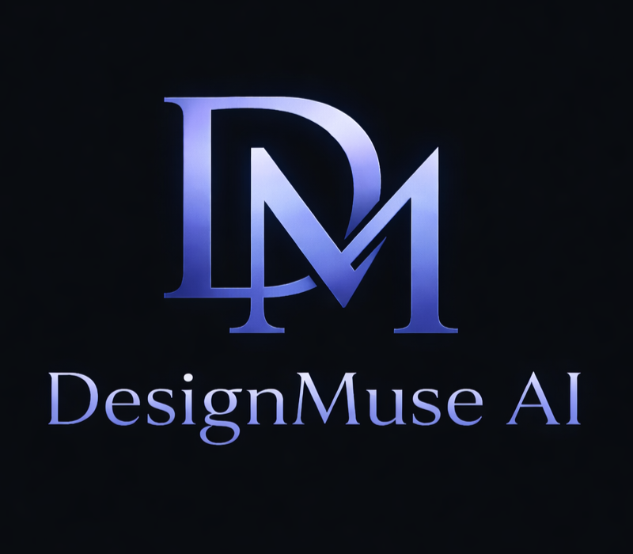
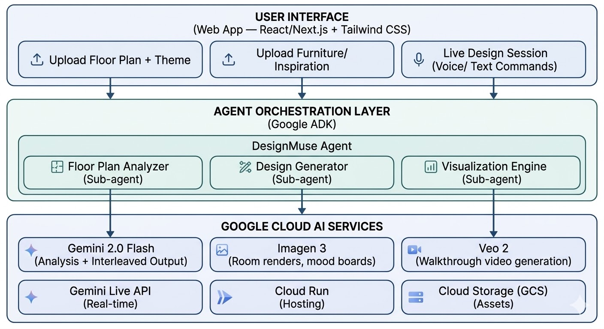
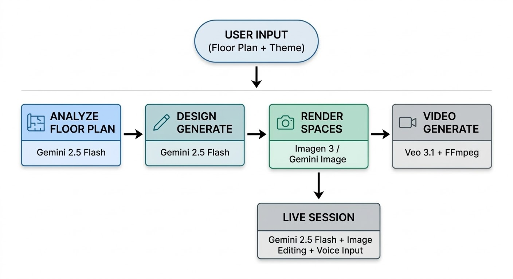

# DesignMuse AI
[](frontend/public/full_indigo_font.png)

> Personalized AI Interior Design Agent — Transform any floor plan into a fully visualized, themed living space.

[](https://ai.google.dev/)
[](LICENSE)

## What is DesignMuse?

DesignMuse AI is an agentic interior design system powered by Google Gemini. Upload a floor plan, choose a theme, and get personalized design recommendations with color palettes, furniture layouts, room renders, and video walkthroughs — all generated by AI.

### Features

1. **Theme-Based Design Generation** — Upload a floor plan image and pick a theme (Greek Mediterranean, Japanese Zen, Industrial Loft, etc.). The agent analyzes the layout and generates room-by-room design recommendations with color palettes, furniture suggestions, materials, and photorealistic renders for every space. Images stream in progressively as they are generated.

2. **Live Interactive Design Session** — Chat with the AI designer in real-time via text or voice. Request changes ("swap the sofa to dark leather", "add a bookshelf to the alcove") and see the design update. Upload a reference photo of furniture or decor and the system extracts the item and places it into the existing room image. Confirm changes to update the main design.

3. **Personalized Video Visualization** — Generate a cinematic walkthrough video of your redesigned apartment. Each room's generated image is turned into a video clip and stitched together into a full apartment tour, with real-time progress tracking.

## Tech Stack

| Technology | Role |
|---|---|
| **Gemini 2.5 Flash** | Floor plan analysis, design generation (JSON), live session chat |
| **Gemini 2.5 Flash Image** | Image editing in live sessions (edit existing room renders in-place) |
| **Imagen 3** (`imagen-3.0-fast-generate-001`) | Primary room render generation |
| **Veo 3.1** (`veo-3.1-fast-generate-001`) | Per-room video clip generation for walkthroughs |
| **FFmpeg** | Stitches individual room clips into a single walkthrough video |
| **FastAPI** (Python) | Backend API with SSE streaming |
| **Next.js 15 + Tailwind CSS 4** | Frontend UI |
| **Web Speech API** | Browser-based voice input in live sessions |
| **Docker Compose** | Containerized deployment |
| **Google Cloud Vertex AI** | Model hosting and API access |

## Quick Start

### Prerequisites

- Docker & Docker Compose
- Google Cloud project with Vertex AI API enabled
- `gcloud` CLI authenticated (`gcloud auth application-default login`)

### 1. Clone & Configure

```bash
git clone https://github.com/your-org/design-muse-ai.git
cd design-muse-ai
cp .env.example .env
```

Edit `.env` with your GCP project details:

```
USE_VERTEX_AI=true
GOOGLE_CLOUD_PROJECT=your-gcp-project-id
GOOGLE_CLOUD_LOCATION=us-central1
```

### 2. Enable Required APIs

```bash
gcloud services enable aiplatform.googleapis.com
```

### 3. Run with Docker Compose

```bash
docker compose up --build -d
```

The app will be available at:
- **Frontend:** http://localhost:3000
- **Backend API:** http://localhost:8000

### Running Without Docker

**Backend:**
```bash
cd backend
python -m venv venv
source venv/bin/activate  # Windows: venv\Scripts\activate
pip install -r requirements.txt
uvicorn backend.main:app --reload --port 8000
```

**Frontend:**
```bash
cd frontend
npm install
npm run dev
```

### Environment Variables

| Variable | Required | Description |
|---|---|---|
| `USE_VERTEX_AI` | Yes | Set to `true` for Google Cloud |
| `GOOGLE_CLOUD_PROJECT` | Yes | Your GCP project ID |
| `GOOGLE_CLOUD_LOCATION` | No | Region for Imagen/Veo (default: `us-central1`) |
| `IMAGE_EDIT_MODELS` | No | Comma-separated Gemini image models (default: `gemini-2.5-flash-image,gemini-3.1-flash-image-preview`) |
| `BACKEND_PORT` | No | Backend port (default: `8000`) |
| `CORS_ORIGINS` | No | Allowed CORS origins (default: `http://localhost:3000`) |

## Architecture

[](frontend\public/high_level_design.jpg)

---

## System Workflow

[](frontend/public/workflow_diagram.jpg)

## Project Structure

```
design-muse-ai/
├── backend/
│   ├── main.py              # FastAPI entry point with SSE streaming
│   ├── agents/
│   │   ├── orchestrator.py  # Multi-agent orchestrator
│   │   ├── floor_plan.py    # Floor plan analysis agent
│   │   ├── designer.py      # Design generation + modification agent
│   │   └── visualizer.py    # Room rendering + video agent
│   ├── services/
│   │   ├── client.py        # GenAI client factory (Vertex AI / API key)
│   │   ├── gemini.py        # Gemini text, JSON, image edit integration
│   │   ├── imagen.py        # Imagen 3 + Gemini native image fallback
│   │   └── veo.py           # Veo 3.1 video generation + FFmpeg stitching
│   └── models/
│       └── schemas.py       # Pydantic data models
├── frontend/
│   ├── app/                 # Next.js app directory
│   │   ├── page.tsx         # Main page with tab navigation
│   │   ├── layout.tsx       # Root layout
│   │   └── globals.css      # Global styles
│   ├── components/
│   │   ├── Header.tsx       # App header with logo
│   │   ├── FloorPlanUpload.tsx
│   │   ├── ThemeSelector.tsx
│   │   ├── DesignResults.tsx # Progressive image loading
│   │   ├── LiveSession.tsx  # Chat + voice + image upload
│   │   └── VisualizationPanel.tsx # Video walkthrough
│   └── public/
│       └── logo.png         # DesignMuse logo
├── logo/                    # Source logo assets
├── docs/
│   ├── ARCHITECTURE.md
│   └── DEMO.md
├── Dockerfile               # Backend container
├── docker-compose.yml       # Full-stack orchestration
├── requirements.txt         # Python dependencies
└── .env.example             # Environment variable template
```

## API Endpoints

| Method | Path | Description |
|---|---|---|
| `POST` | `/api/design/generate` | Analyze floor plan + generate themed design (SSE stream) |
| `POST` | `/api/visualize/walkthrough` | Generate walkthrough video from design images (SSE stream) |
| `POST` | `/api/live/start` | Start a live design session |
| `POST` | `/api/live/message` | Send text/image modification request (multipart) |
| `POST` | `/api/live/confirm` | Confirm live session changes to main design |
| `GET` | `/health` | Health check |

## License

MIT — see [LICENSE](LICENSE) for details.

## Acknowledgments

This project is built by [**Dr. Aditya Bhattacharya**](https://www.linkedin.com/in/adi-phd/) . Powered by Google Gemini, Imagen 3, Veo 3.1, and Google Cloud.
